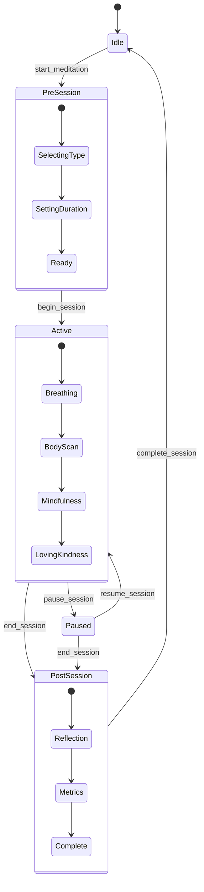

# Session State Chart

## Meditation Session States

## State Descriptions

### Idle
- User is not in an active meditation session
- Available actions: start new session, view progress, check stress level

### PreSession
- User is setting up a new meditation session
- Substates: selecting meditation type, setting duration, confirming readiness

### Active
- User is actively meditating
- Substates: different meditation techniques (breathing, body scan, etc.)
- Available actions: pause, end session

### Paused
- Session is temporarily paused
- Available actions: resume, end session

### PostSession
- Session has ended, collecting feedback and updating metrics
- Substates: reflection, metrics update, completion

## Triggers

- `start_meditation`: User initiates a new session
- `begin_session`: User confirms session parameters and starts
- `pause_session`: User pauses active session
- `resume_session`: User resumes paused session
- `end_session`: User ends current session
- `complete_session`: Post-session activities are finished